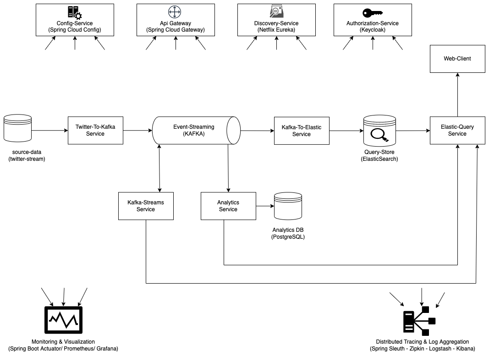

## Architecture Overview



### Services

- **Config-server**: Spring-cloud-config, retrieves the configs in config-server-repository and each service use them.

- **Twitter-to-kafka-service**: Simulates a stream of tweets from twitter and send them to a kafka topic called "twitter-topic".

- **Kafka-to-elastic-service**: Consumes the events from "twitter-topic" and send to Elasticsearch.

- **Kafka-streams-service**: Consumes the events from "twitter-topic" and group them by (key, word) and after count (word-count):

  - Save the result in the kafka streams state store.
  - It sends the new event (word, count) to "twitter-analytics-topic".

  This service offers a RESTful api to retrieve the words count from the kafka streams state store.

- **Analytics-service**: Consumes the events from "twitter-analytics-topic" and persist them in postgreSQL. It offers as well a RESTful api to retrieve the words count from the postgreSQL db.

- **Elastic-query-Service**: Query Elasticsearch based on client interactions. Returns how many times a word appears in each document. To accomplish that it can make a REST request to Analytics-service or Elastic-query-service (to choose go in docker-compose/services.yml and for elastic-query-service-1 or elastic-query-service-2 change:"ELASTIC-QUERY-SERVICE_WEBCLIENT_QUERY-TYPE" to "ANALYTICS_DATABASE" or "KAFKA_STATE_STORE").

- **Elastic-query-web-client**: Client that allows the user to login and search for a tweet. It asks to elastic-query-service to retrieve the tweets based on the user input in the search bar. It as well returns the words count to see in how many documents each word appears. 
- **Elastic-query-web-client-2**: Same but created to show how to implement SSO (more info in [security readme](./doc/SECURITY.md)).
- **Discovery-service**: Server for service registration and discovery.

### Modules

- **App-config-data**: Objects representing the configs retrieved from spring-cloud-config.

- **Common config**: common configs.

- **Common util**: common utils.

- **Elastic Folders**
  - Elastic-config: Get the configs to communicate correctly with Elasticsearch.
  - Elastic-index-client: Index correctly the documents in Elasticsearch.
  - elastic-model: define the index model and the tweet model for Elasticsearch.
  - Elastic-query-client: define how to query Elasticsearch to get documents.

- **Kafka Folders**

  - Kafka-model: Create and hold java object for kafka in Avro format.

  - Kafka-admin: Create and verify Kafka topics programmatically.

  - Kafka-producer: Use spring-kafka to write Kafka producer implementation.
  - Kafka-consumer: Use spring-kafka to write Kafka consumer implementation.


## SECURITY

Check [this page for more info about security (0Auth + OpenId Connect with Keycloak explaination included).](./doc/SECURITY.md)

## HOW TO RUN IT 

Launch docker.

From the root folder to create the docker images type in the terminal:

```
mvn clean install -DskipTests
```

Make all the scripts runnable (needed for the services in docker-compose):

```
chmod +x docker-compose/scripts/*.sh
```

To access the web client on browser, we need to update the DNS with hostnames, because when web-client, for instance, is redirecting to the user login (keycloack), it will do it to http://keycloack-authorization-server:9091 hostname, that is the container running in docker-compose and externally is accessible on localhost:9091. So from the terminal let's type:

```
vi /etc/hosts
```

and after add:

```
127.0.0.1       keycloak-authorization-server
127.0.0.1       elastic-query-service-1
127.0.0.1       elastic-query-service-2
127.0.0.1       elastic-query-web-client-1
127.0.0.1       elastic-query-web-client-2
```

And save.

Now we can run everything from the folder docker-compose typing:

```
docker-compose up
```

You can access the elastic-query-web-client from browser at:

 http://elastic-query-web-client-1:8184/elastic-query-web-client/

To login: 

Username: app_super_user

Password: super_user
