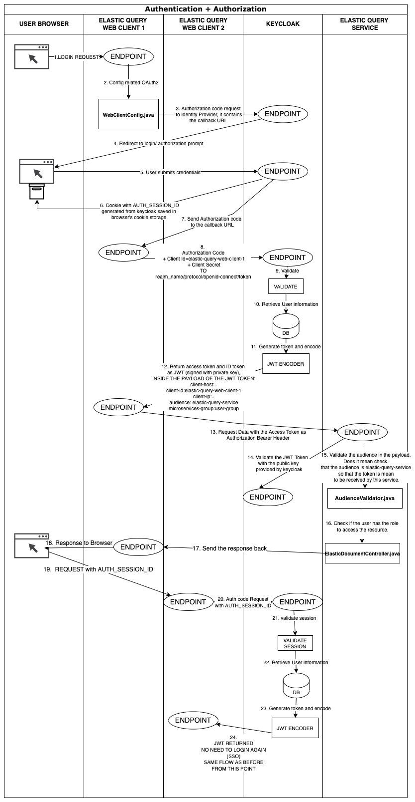
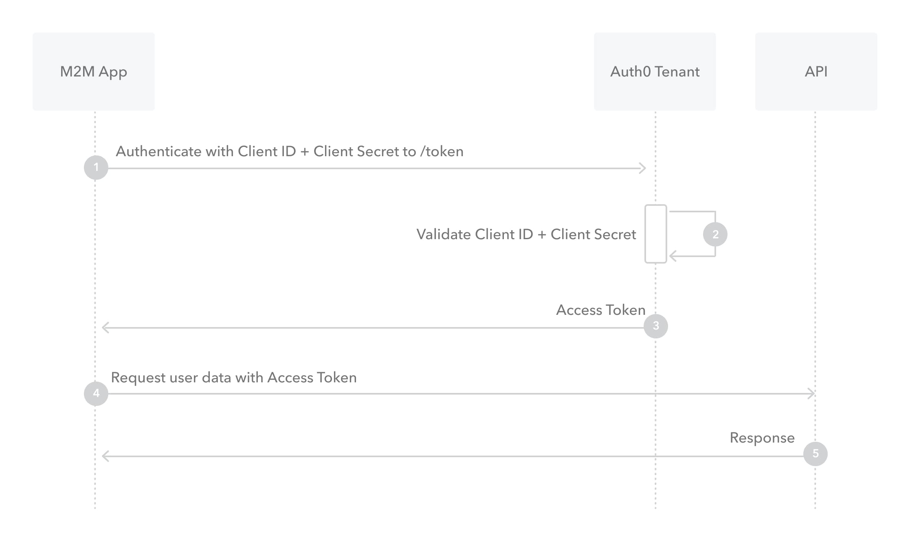

# SECURITY

## AUTHORIZATION CODE FLOW

Because regular web apps are server-side apps where the source code is not  publicly exposed, they can use the **Authorization Code Flow** (defined in [OAuth 2.0 RFC 6749, section 4.1](https://tools.ietf.org/html/rfc6749#section-4.1)), which exchanges an Authorization Code(password) for a token. Your app must be  server-side because during this exchange, you must also pass along your  application's Client Secret, which must always be kept secure, and you  will have to store it in your client.

**NOTE:** Once the user send the request with Access Token, the 0Auth specification doesn't say how you can validate it, but due the fact we use JWT with asymetric key, the web app will  download the public key from  http://issuer-uri/protocol/open-id-connects/certs and so can validate part of the token signed with the private one. You can see a more concise flow below:

**NOTE**: From point 19. the user doesn't need to log again, but this works only if the client is in the same browser, because it has a cookie called AUTH_SESSION_ID. It is used on Keycloak side along with the realm name and then determines an already authenticated session in Keycloak. In our case we have two different applications elastic-query-web-client-1 and elastic-query-web-client-2 but on the same browser, **as long as they share the same realm on keycloak, we can have SSO.** Different SSO protocols share session information in different ways, but the essential concept is the same: there is a **central domain**, through which authentication is performed, and then the **session is shared** with other domains in some way.  For instance, the central domain may generate a signed [JSON Web Token (JWT)](https://auth0.com/docs/jwt), which may be encrypted using [JSON Web Encryption (JWE)](https://tools.ietf.org/html/rfc7516). This token may then be passed to the client and used by the  authentication domain as well as any other domains. The token can be  passed to the original domain by a redirect and it contains all the  information needed to identify the user for the domain requiring  authentication. As the token is signed, it cannot be modified in any way by the client.

**NOTE**: To show how to use the roles, there are 3: app_user_role, app_admin_role and app_super_user. In the DB there are 3 documents: "Example Document 1", "Example Document 2", "Example Document 3", the app_user_role can access the first two, the app_admin_role only the last one and app_super_user can access all.

## CLIENTS CREDENTIALS FLOW

For the service elastic-query communicating to kafka streams service, we don't need to  authenticate a user, the user has been already authenticated at this point, so we just send the client ID + Client secret to get the token for elastic-query service and with this access token send the request to kafka-streams-service.

With machine-to-machine (M2M) applications, such as CLIs, daemons, or  services running on your back-end, the system authenticates and  authorizes the app rather than a user. For this scenario, typical  authentication schemes like username + password or social logins don't  make sense. Instead, M2M apps use the Client Credentials Flow (defined  in [OAuth 2.0 RFC 6749, section 4.4](https://tools.ietf.org/html/rfc6749#section-4.4)), in which they pass along their Client ID and Client Secret to authenticate themselves and get a token.

## CONFIGURE KEYCLOAK

http://localhost:9091/admin/master/console/#/microservices_realm/clients

username: admin

password: admin

### MICROSERVICES_REALM 

You can think of realm as a tenant. So the first thing you will want to do is create a realm for your application and users. A realm is fully isolated (in terms of configuration, users, roles, etc) from other realms. Because of this, you can create one realm for internal applications and your employees and another realm for external applications and customers.

### FIRST WE NEED TO DEFINE THE BASIC ROLES AND USERS: 

1. **ROLES** = usually represent a role a user has in either your organization or in the context of your application. For example, users can be granted an administrator role therefore they can access and perform any action on any resource in your application. Or, they can be granted a human resources manager role therefore they can only access and perform some actions on limited resources.  Keycloak also provides the concept of composite roles. 

   We have 3 roles defined in our application:

   	- app_user_role
   	- app_admin_role
   	- app_super_user_role

2. **GROUPS** = Groups in Keycloak allow you to manage a common set of attributes and role mappings for a set of users. Users can be members of zero or more groups. Users inherit the attributes and role mappings assigned to each group.

   We have 3 groups defined in our application:

    - app_user_group
    - app_admin_group
    - app_super_user_group

   And we assign the corresponding role to the group, for instance app_user_role -> app_user_group.

3. **USERS** = You create users in the realm where you intend to have applications needed by those users.

   We create 3 users for our application:

   - "app_user" with password "user"
   - "app_admin" with password "admin"
   - "app_super_user" with password "super_user"

​	Then we assign to each user the correspective group, e.g. app_user_group -> app_user

### NOW WE CREATE CLIENT SCOPES

**CLIENT SCOPES** = Client scopes are a common set of protocol mappers and roles that are shared between multiple clients.

- app_user_role and we assign the role app_user_role. By matching a role with a scope, we will restrict the returned scopes in a JWT and only return scopes that users roles match.
- app_admin_role and we assign  the role app_admin_role.
- app_super_user_role and we assigb the role app_super_user_role

### NOW WE CAN CREATE THE CLIENT:

CLIENT = Entities that can request Keycloak to authenticate a user. Most often, clients are web, mobile and native applications that want to use keycloak to secure themselves and provide a single sign-on solution.

**elastic-query-webclient**:

1. We set Client Authentication ON. When it's ON, the OIDC type is set to confidential access type. When it's OFF, it is set to public access type.
2. By default we have enabled standard. In terms of OpenID Connect or OAuth2 specifications, this enables support of 'Authorization Code Flow' for this client.
4. We will add redirect uri as "http://elastic-query-web-client-1:8184/elastic-query-web-client/login/oauth2/code/keycloak"
5. As valid post logout redirect URI: http://elastic-query-web-client-1:8184/elastic-query-web-client, to be used a successful  path for post logout
6. Home URL (Default URL to use when the auth server needs to redirect or link back to the client): http://elastic-query-web-client-1:8184/elastic-query-web-client
7. Web origins (allowed CORS origins), we add: "http://elastic-query-web-client-1:8184".
8. Then we copy the client secret in the credentials. We will use this secret with client id in our services to authenticate clients to keycloak.
9. PROTOCOL MAPPERS= **User property protocol mappers allow you to map built in properties defined on the Keycloak user interface to a claim in a token.  Protocol mappers  can be defined for a single client, or they can be defined for a client  scope that can be shared between multiple different clients.** We define mappers for our client secret, saying what we wanna return inside the token.:
   1. We will add user groups as group membership.  We want to see the group where the user belong to and use them in the authorization code (this in JWT will be in the payload token). So we add a new mapper of type: "Group Membership". In the field "token claim name" (Name of the claim to insert into the token) we set groups (disable full group path in the option).
   2. Second we will add a mapper of type "audience" with a name "elastic-query-service" and add it to only access token. It is a list of String values, according to OpenID Connect specification, audience claim is mandatory for id tokens. And it's specified as the audience that is the id token intended for (**defines the intended recipients of the token**). It must contain the 0Auth2 client id of the relying party as an audience value. In our case the intended recipient of the token is elastc-query-service, because we will call elastic-query-service from the web client. We will check it on resource server by overriding Jwt decoder and adding a validation for this audience.
   3. Finally we will add 3 more mappers of type User session note: "clientID", "clientHost" and "clientIPAddress". Those 3 variables also will be mapped to token and we can reach them when we decode the JWT.
10. We assign to the elastic-query-webclient the 3 client scope : app_user_role, app_admin_role and app_user_role as default. **Note**: A client token by default will include scopes and spring security will map those scopes to the spring security authorities, by using a SCOPE_ prefix. To map them to Spring security user roles, with a prefix ROLE_, and use hasRole preAuthorize annotation, we need to use custom JWT encoders or mappers.
11. In clients enable "Service accounts roles": it allows you to authenticate this client to Keycloak and retrieve access  token dedicated to this client. In terms of OAuth2 specification, this  enables support of 'Client Credentials Grant' for this client.

NOW we can create a second client with name **elastic-query-web-client-2** for single sign-on. It will be the same as the previous one, just that we use this client to implement a single sign-on solution:

1. We will add redirect uri as "http://elastic-query-web-client-2:8186/elastic-query-web-client/login/oauth2/code/keycloak"

2. As valid post logout redirect URI: http://elastic-query-web-client-2:8186/elastic-query-web-client, to be used a successful  path for post logout

3. Home URL (Default URL to use when the auth server needs to redirect or link back to the client): http://elastic-query-web-client-2:8186/elastic-query-web-client

4. Web origins (allowed CORS origins), we add: "http://elastic-query-web-client-2:8186".

5. We assign to the elastic-query-webclient the 3 client scope : app_user_role, app_admin_role and app_user_role as default

6. We define mappers for our client secret, saying what we wanna return inside the token.:

   1. We will add user groups as group membership.  We want to see the group where the user belong to and use them in the authorization code (this in JWT will be in the payload token). So we add a new mapper of type: "Group Membership". In the field "token claim name" (Name of the claim to insert into the token) we set groups (disable full group path in the option).
   2. Second we will add a mapper of type "audience" with a name "elastic-query-service" and add it to only access token. It is a list of String values, according to OpenID Connect specification, audience claim is mandatory for id tokens. And it's specified as the audience that is the id token intended for (**defines the intended recipients of the token**). It must contain the 0Auth2 client id of the relying party as an audience value. In our case the intended recipient of the token is elastc-query-service, because we will call elastic-query-service from the web client. We will check it on resource server by overriding Jwt decoder and adding a validation for this audience.
   3. Finally we will add 3 more mappers of type User session note: "clientID", "clientHost" and "clientIPAddress". Those 3 variables also will be mapped to token and we can reach them when we decode the JWT.

   

   FINALLY we create a third client, named elastic-query-service for the resource server. **THE IMPORTANT DIFFERENCE WITH THE OTHER 2 SERVICES:** is that we use client_credentials for the authorization type, instead of authorization code flow. **REMEMBER THAT CLIENT_CREDENTIALS is used for MACHINE-TO-MACHINE communication, when there no user interaction required. IN OUR CASE FROM THIS SERVICE WE CALL KAFKA STREAMS SERVICE (MACHINE-TO-MACHINE)** 

   1. We set Client Authentication ON. When it's ON, the OIDC type is set to confidential access type. When it's OFF, it is set to public access type.
   2. Direct access grants on (if it is at this point, the user is already authenticated): This enables support for Direct Access Grants, which means that client  has access to username/password of user and exchange it directly with  Keycloak server for access token. In terms of OAuth2 specification, this enables support of 'Resource Owner Password Credentials Grant' for this client.
   3. In clients enable "Service accounts roles": it allows you to authenticate this client to Keycloak and retrieve access  token dedicated to this client. In terms of OAuth2 specification, this  enables support of 'Client Credentials Grant' for this client. We can then use client credentials flow, which is machine to machine call. So we will call from one resource server to another resource server without any user interaction and just using clientID and secret.
   4. We will add redirect uri as "http://elastic-query-service-1:8183/elastic-query-service"
   5. As valid post logout redirect URI: http://elastic-query-service-1:8183/elastic-query-service/login/oauth2/code/keycloak, to be used a successful  path for post logout
   6. Home URL (Default URL to use when the auth server needs to redirect or link back to the client):http://elastic-query-service-1:8183/elastic-query-service
   7. Web origins (allowed CORS origins), we add: "http://elastic-query-service-1:8183".
   8. We assign to the elastic-query-webclient the 3 client scope : app_user_role, app_admin_role and app_user_role as default
   9. We define mappers for our client secret, saying what we wanna return inside the token.:
      1. We will add user groups as group membership.  We want to see the group where the user belong to and use them in the authorization code (this in JWT will be in the payload token). So we add a new mapper of type: "Group Membership". In the field "token claim name" (Name of the claim to insert into the token) we set groups (disable full group path in the option).
      2. Second we will add a mapper of type "audience" but this time we will add two values, because from elastic-query-service we want to make a call either to kafka-streams-service or analytics-service, so we create those two audience's mappers. And then we will check on the resource server to be included at least one of these values.
      3. Finally we will add 3 more mappers of type User session note: "clientID", "clientHost" and "clientIPAddress". Those 3 variables also will be mapped to token and we can reach them when we decode the JWT.
   
   
   
   ## Understanding Spring Security with Spring Security OAuth 2.0 resource server
   
   Resource server provides resources to clients that provides valid access tokens. In spring security 5, automatically configures a resource server by only specifying the issuer-uri value. Resource server can use:
   
     http://issuer-uri/protocol/open-id-connects/certs 
   
   to obtain keys for signature validation.
   
   With OAuth 2 protocol it is better to use stateless session policy for resource server, to force the client to be reauthenticated in each request in a rest API. So we can set SessionCreationPolicy.STATELESS to prevent creating JSESSIONID and avoid using cookies and re-authenticate client in each request. We can also disable CSRF protection as we do not need it without session cookies.
   
   We can use custom JWT decoder to include custom validators for claims like nonce and audience. By default spring security includes authorities created with SCOPE_ prefix for the scopes defined in JWT. We can use a custom JWT converter to extract scopes and roles from token and convert into spring security authorities. We can also use local storage like database record to get a user information or permission.
   
   We can then use method level @PreAuthorize, @PostAuthorize spring security annotations and check authorization using: hasRole and hasAuthority and hasPermission methods.
   
   